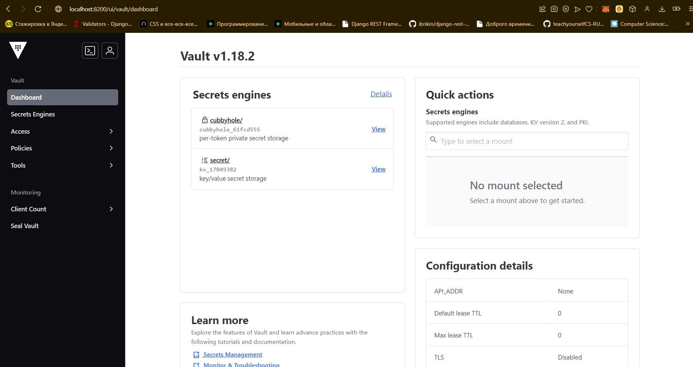
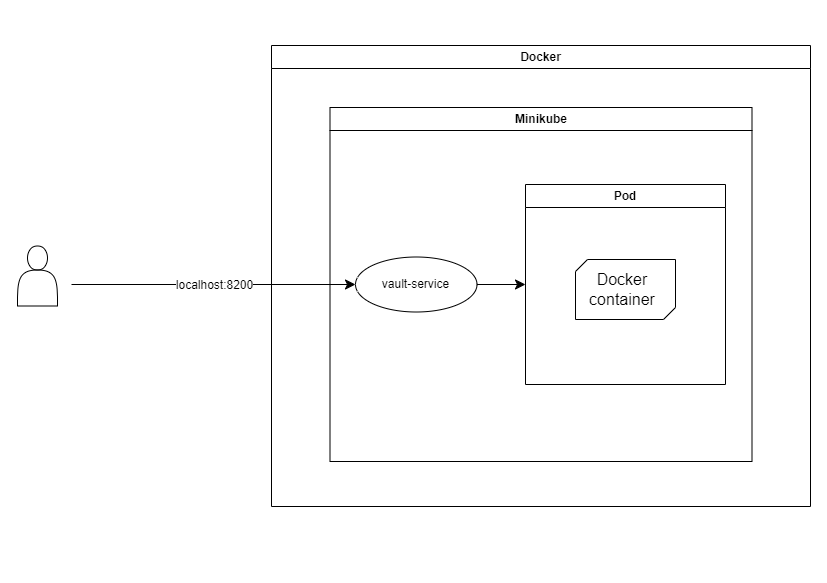

University: [ITMO University](https://itmo.ru/ru/)

Faculty: [FICT](https://fict.itmo.ru/)

Course: [Introduction to distributed technologies](https://github.com/itmo-ict-faculty/introduction-to-distributed-technologies)

Year: 2024/2025

Group: K4110c

Author: Vasilyev Stepan Aleksandrovich

Lab: Lab1

Date of create: 13.12.2024

Date of finished: none

# Описание
Это первая лабораторная работа в которой вы сможете протестировать Docker, установить Minikube и развернуть свой первый "под".

# Цель работы
Ознакомиться с инструментами Minikube и Docker, развернуть свой первый "под".

# Ход работы

## 0. Установка Docker и Minikube

1. Скачать и установить [Docker](https://docs.docker.com/desktop/), следуя официальным инструкциям
2. Скачать и установить [Minikube](https://minikube.sigs.k8s.io/docs/start/?arch=%2Fwindows%2Fx86-64%2Fstable%2F.exe+download), следуя официальным инструкциям

## 1. Запуск Minikube

1. Ввести следующую команду в терминале, чтобы развернуть minikube cluster

```bash
minikube start
```

2. Убедиться, что всё работает корректно с помощью команды

```bash
minikube status
```

## 2. Написание манифеста

1. Создать файл vault.yaml
2. Прописать конфигурацию Pod

```yaml
apiVersion: v1
kind: Pod                                            
metadata:
  name: vault
  labels:
    app: vault                         
spec:                                                
  containers:
    - image: hashicorp/vault:latest # ссылка на контейнер (dockerhub)
      name: vault                             
      ports:
      - containerPort: 8200 # порт, на котором контейнер принимает запросы
```

3. Прописать конфигурацию Service

```yaml
apiVersion: v1
kind: Service
metadata:
  name: vault-service
  labels:
    app: vault  
spec:
  selector:
    app: vault # связывание Service и Pod 
  type: NodePort
  ports:
    - port: 8200 # внешний порт
      targetPort: 8200 # внутренний порт пода
      protocol: TCP  
```

### Финальный манифест

```yaml
apiVersion: v1
kind: Pod                                            
metadata:
  name: vault
  labels:
    app: vault                         
spec:                                                
  containers:
    - image: hashicorp/vault:latest 
      name: vault                             
      ports:
      - containerPort: 8200

---

apiVersion: v1
kind: Service
metadata:
  name: vault-service
  labels:
    app: vault  
spec:
  selector:
    app: vault 
  type: NodePort
  ports:
    - port: 8200 
      targetPort: 8200
      protocol: TCP  
```

## 3. Запуск Vault

1. Перейти в директорию, где расположен манифест
2. Применить манифест

```bash
kubectl apply -f vault.yaml
```

3. Проверить состояние пода

```bash
kubectl get pods
```

4. Перенаправить порт Service на локальный порт

```bash
kubectl -- port-forward service/vault-service 8200:8200
```

5. Перейти по адресу [http://localhost:8200](http://localhost:8200/) и проверить работоспособность контейнера
6. Открыть логи контейнера 

```bash
kubectl logs vault
```

7. Скопировать содержимое строки **Root Token**
8. Залогиниться на сайте с помощью Root Token



9. Остановить Minikube

```bash
minikube stop
```

### Схема организации контейнеров и служб

