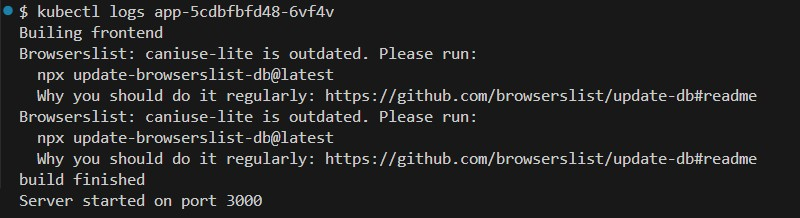

University: [ITMO University](https://itmo.ru/ru/)

Faculty: [FICT](https://fict.itmo.ru/)

Course: [Introduction to distributed technologies](https://github.com/itmo-ict-faculty/introduction-to-distributed-technologies)

Year: 2024/2025

Group: K4110c

Author: Vasilyev Stepan Aleksandrovich

Lab: Lab2

Date of create: 15.12.2024

Date of finished: none

# Описание
В данной лабораторной работе вы познакомитесь с развертыванием полноценного веб сервиса с несколькими репликами.

# Цель работы
Ознакомиться с типами "контроллеров" развертывания контейнеров, ознакомится с сетевыми сервисами и развернуть свое веб приложение.

# Ход работы

## 1. Запуск Minikube

1. Ввести следующую команду в терминале, чтобы развернуть minikube cluster

```bash
minikube start
```

2. Убедиться, что всё работает корректно с помощью команды

```bash
minikube status
```

## 2. Написание манифеста

1. Создать файл deployment.yaml
2. Прописать конфигурацию Deployment

```yaml
apiVersion: apps/v1
kind: Deployment
metadata:
  name: app
  labels:
    app: app
spec:
  replicas: 2
  selector:
    matchLabels:
      app: frontend
  template: # указываем, какие поды будут входить в Deployment
    metadata:
      labels:
        app: frontend
    spec:
      containers:
        - image: ifilyaninitmo/itdt-contained-frontend:master
          name: frontend-container
          ports:
            - containerPort: 3000 # пишем порт, который указан на docker hub
          env: # передаём необходимые переменные
            - name: REACT_APP_USERNAME
              value: yerrange
            - name: REACT_APP_COMPANY_NAME
              value: feel_good_inc
```

3. Прописать конфигурацию Service
```yaml
apiVersion: v1
kind: Service
metadata:
  name: frontend-service
spec:
  selector:
    app: frontend
  type: NodePort
  ports:
    - port: 8200
      targetPort: 3000
      protocol: TCP
```

### Финальный манифест

```yaml
apiVersion: apps/v1
kind: Deployment
metadata:
  name: app
  labels:
    app: app
spec:
  replicas: 2
  selector:
    matchLabels:
      app: frontend
  template:
    metadata:
      labels:
        app: frontend
    spec:
      containers:
        - image: ifilyaninitmo/itdt-contained-frontend:master
          name: frontend-container
          ports:
            - containerPort: 3000
          env:
            - name: REACT_APP_USERNAME
              value: yerrange
            - name: REACT_APP_COMPANY_NAME
              value: feel_good_inc

---

apiVersion: v1
kind: Service
metadata:
  name: frontend-service
spec:
  selector:
    app: frontend
  type: NodePort
  ports:
    - port: 8200
      targetPort: 3000
      protocol: TCP
```

## 3. Запуск приложения

1. Перейти в директорию, где расположен манифест
2. Применить манифест

```bash
kubectl apply -f vault.yaml
```

3. Проверить состояние подов

```bash
kubectl get pods
```

4. Перенаправить порт Service на локальный порт

```bash
kubectl -- port-forward service/vault-service 8200:8200
```

5. Перейти по адресу [http://localhost:8200](http://localhost:8200/) и проверить работоспособность контейнера
6. Проверить переданные переменные


Как мы видим, передались именно те переменные и значения, которые мы указали в манифесте;
Именно поэтому переменные **REACT_APP_USERNAME** и **REACT_APP_COMPANY_NAME** не будут изменяться,
но могут измениться переменные **Container name** и **IP**, в зависимости от того,
в какой контейнер попадёт запрос

7. Проверить логи контейнеров

```bash
kubectl get podes
```


Первый контейнер
```bash
kubectl logs app-5cdbfbfd48-6vf4v
```


Второй контейнер
```bash
kubectl logs app-5cdbfbfd48-9jtv2
```


Можно заметить, что их логи полностью совпадают

### Схема организации контейнеров и служб

