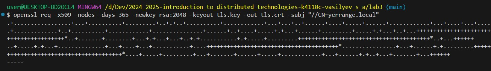
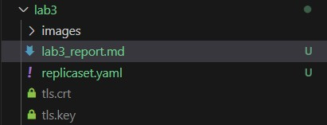
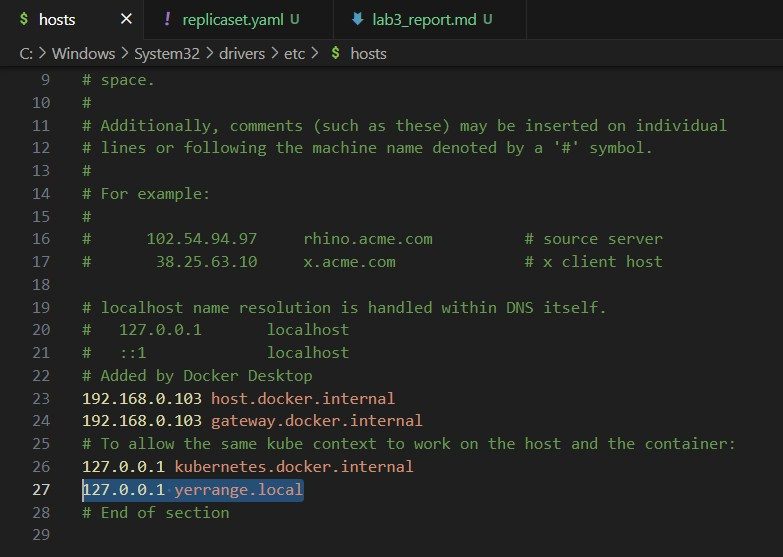
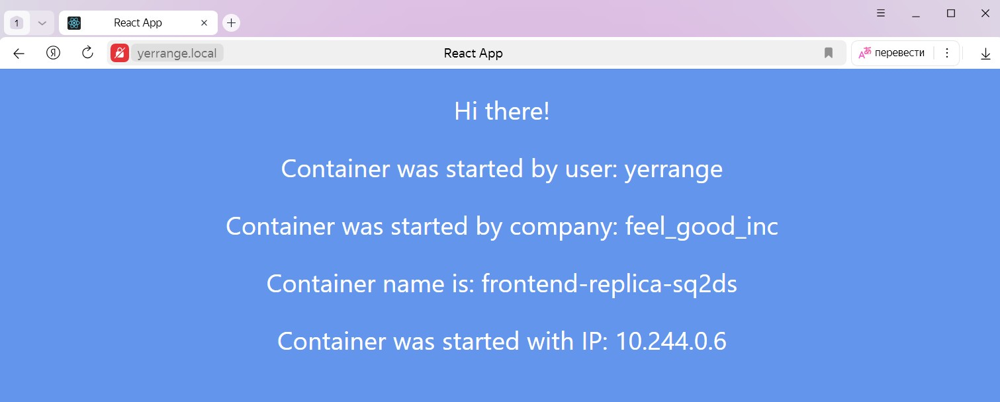
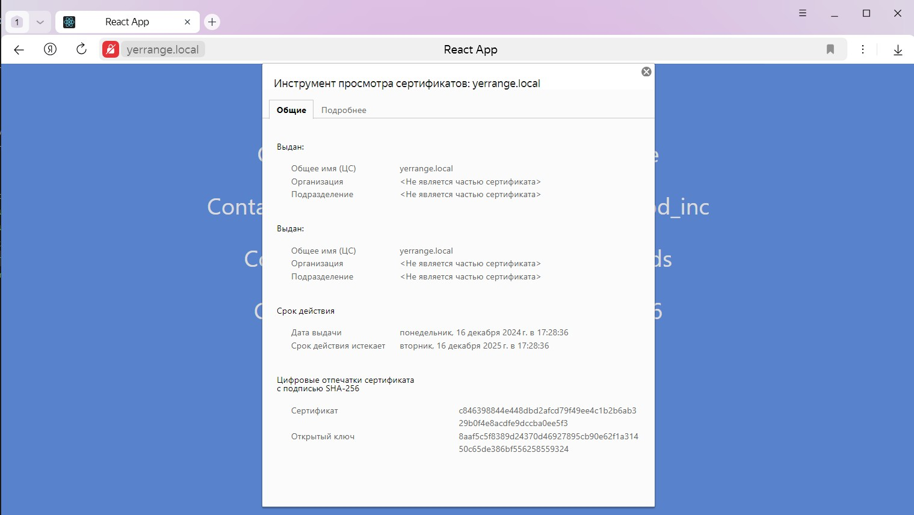
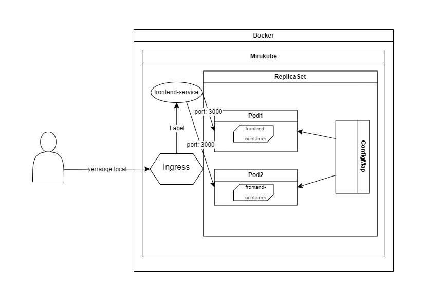

University: [ITMO University](https://itmo.ru/ru/)

Faculty: [FICT](https://fict.itmo.ru/)

Course: [Introduction to distributed technologies](https://github.com/itmo-ict-faculty/introduction-to-distributed-technologies)

Year: 2024/2025

Group: K4110c

Author: Vasilyev Stepan Aleksandrovich

Lab: Lab2

Date of create: 15.12.2024

Date of finished: none

# Описание
В данной лабораторной работе вы познакомитесь с сертификатами и "секретами" в Minikube, правилами безопасного хранения данных в Minikube.

# Цель работы
Познакомиться с сертификатами и "секретами" в Minikube, правилами безопасного хранения данных в Minikube.

# Ход работы

## 1. Запуск Minikube

1. Ввести следующую команду в терминале, чтобы развернуть minikube cluster

```bash
minikube start
```

2. Убедиться, что всё работает корректно с помощью команды

```bash
minikube status
```

## 2. Выпуск сертификата и создание секрета

1. С помощью утилиты **openssl** сгенерировать сертификат 
```bash
openssl req -x509 -nodes -days 365 -newkey rsa:2048 -keyout tls.key -out tls.crt -subj "/CN=yerrange.local"
```
*"/CN=[адрес_вашего_сайта]"

*в случае возникновения ошибки **req: subject name is expected to be in the format /type0=value0/type1=value1/type2=... where characters may be escaped by \.** добавить второй слэш перед "/CN"

```bash
openssl req -x509 -nodes -days 365 -newkey rsa:2048 -keyout tls.key -out tls.crt -subj "//CN=yerrange.local"
```




2. Создать секрет из файлов tls.crt и tls.key

```bash
kubectl create secret tls frontend-tls --key tls.key --cert tls.crt
```

## 3.Написание манифеста

1. Создать файл replicaset.yaml
2. Прописать конфигурацию СonfigMap

```yaml
apiVersion: v1
kind: ConfigMap
metadata:
  name: frontend-env
data:
  REACT_APP_USERNAME: "yerrange"
  REACT_APP_COMPANY_NAME: "feel_good_inc"
```

3. Прописать конфигурацию ReplicaSet

```yaml
apiVersion: apps/v1
kind: ReplicaSet                                            
metadata:
  name: frontend-replica
  labels:
    app: frontend                   
spec:
  replicas: 2
  selector:
    matchLabels:
      app: frontend
  template:
    metadata:
      labels:
        app: frontend
    spec:
      containers:
        - image: ifilyaninitmo/itdt-contained-frontend:master
          name: frontend-container
          ports:
            - containerPort: 3000
          envFrom:
          - configMapRef:
              name: frontend-env # связываем контейнер с configMap, созданным в прошлом пункте 
```

4. Прописать конфигурацию Service

```yaml
apiVersion: v1
kind: Service
metadata:
  name: frontend-service
spec:
  selector:
    app: frontend
  type: NodePort
  ports:
    - port: 8200
      targetPort: 3000
      protocol: TCP
```

5. Прописать конфигурацию Ingress

```yaml
apiVersion: networking.k8s.io/v1
kind: Ingress
metadata:
  name: frontend-ingress
spec:
  tls:
    - hosts:
        - yerrange.local # указываем свой FQDN
      secretName: frontend-tls # название ранее созданного секрета, из которого будут браться данные сертификата
  rules:
  - host: yerrange.local # указываем свой FQDN
    http:
      paths:
      - path: /
        pathType: Prefix
        backend:
          service:
            name: frontend-service # связываем Ingress с Service, созданным в предыдущем шаге
            port:
              number: 8200
```

### Финальный манифест

```yaml
apiVersion: v1
kind: ConfigMap
metadata:
  name: frontend-env
data:
  REACT_APP_USERNAME: "yerrange"
  REACT_APP_COMPANY_NAME: "feel_good_inc"

---

apiVersion: apps/v1
kind: ReplicaSet                                            
metadata:
  name: frontend-replica
  labels:
    app: frontend                   
spec:
  replicas: 2
  selector:
    matchLabels:
      app: frontend
  template:
    metadata:
      labels:
        app: frontend
    spec:
      containers:
        - image: ifilyaninitmo/itdt-contained-frontend:master
          name: frontend-container
          ports:
            - containerPort: 3000
          envFrom:
          - configMapRef:
              name: frontend-env

---

apiVersion: v1
kind: Service
metadata:
  name: frontend-service
spec:
  selector:
    app: frontend
  type: NodePort
  ports:
    - port: 8200
      targetPort: 3000
      protocol: TCP

---

apiVersion: networking.k8s.io/v1
kind: Ingress
metadata:
  name: frontend-ingress
spec:
  tls:
    - hosts:
        - yerrange.local
      secretName: frontend-tls
  rules:
  - host: yerrange.local
    http:
      paths:
      - path: /
        pathType: Prefix
        backend:
          service:
            name: frontend-service
            port:
              number: 8200
```

## 4. Запуск приложения

1. Включить ingress и ingress-dns

```bash
minikube addons enable ingress
minikube addons enable ingress-dns
```

2. Применить манифест

```bash
kubectl apply -f replicaset.yaml
```

3. Добавить адрес сайта в C:\Windows\System32\drivers\etc\hosts.file



4. Запустить приложение 

```bash
minikube tunnel
```

5. Перейти по адресу **yerrange.local**



**ВАЖНО!** если содержимое страницы не отображается, но сам сайт работает,
то стоит попробовать разные браузеры

6. Проверить сертификат



### Схема организации контейнеров и служб


