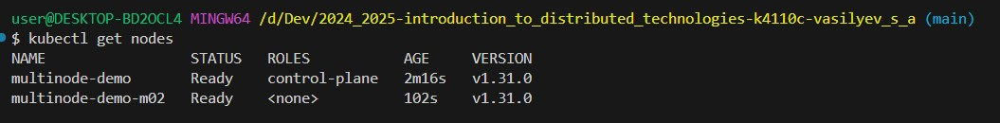
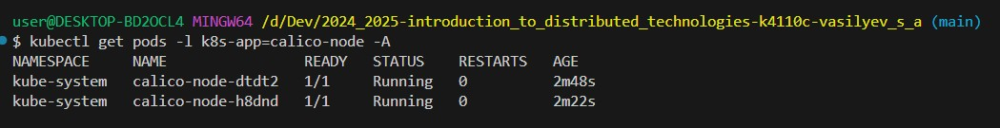
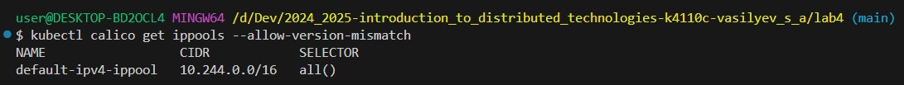
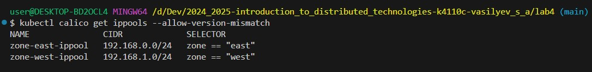
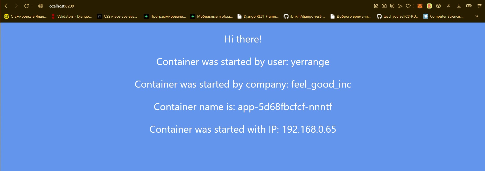
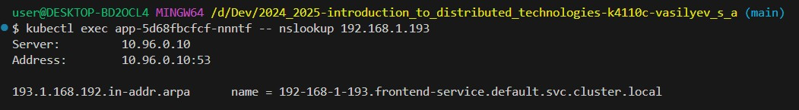
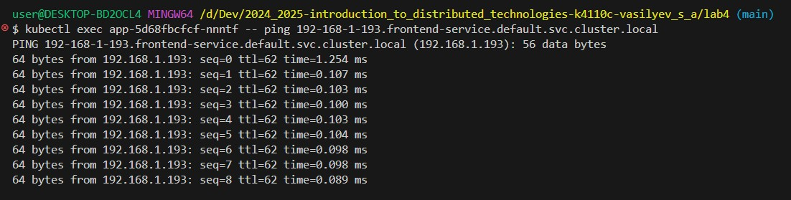
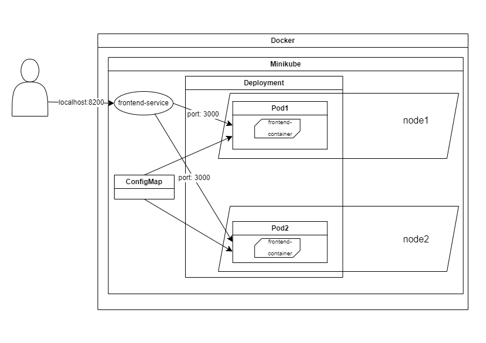

University: [ITMO University](https://itmo.ru/ru/)

Faculty: [FICT](https://fict.itmo.ru/)

Course: [Introduction to distributed technologies](https://github.com/itmo-ict-faculty/introduction-to-distributed-technologies)

Year: 2024/2025

Group: K4110c

Author: Vasilyev Stepan Aleksandrovich

Lab: Lab4

Date of create: 16.12.2024

Date of finished: none

# Описание
Это последняя лабораторная работа в которой вы познакомитесь с сетями связи в Minikube. Особенность Kubernetes заключается в том, что у него одновременно работают underlay и overlay сети, а управление может быть организованно различными CNI.

# Цель работы
Познакомиться с CNI Calico и функцией IPAM Plugin, изучить особенности работы CNI и CoreDNS.

# Ход работы

## 1. Запуск Minikube
1. При запуске Minikube установить плагин CNI=calico и режим работы Multi-Node Clusters одновеременно, развернуть 2 ноды.
```bash
minikube start --network-plugin=cni --cni=calico --nodes 2 -p multinode-demo
```

Официальные инструкции по [Calico](https://docs.tigera.io/calico/latest/getting-started/kubernetes/minikube) 
и [Multi-Node Clusters](https://minikube.sigs.k8s.io/docs/tutorials/multi_node/)

2. Проверить запуск двух нод

```bash
kubectl get nodes
```



3. Проверить запуск Calico

```bash
kubectl get pods -l k8s-app=calico-node -A
```



4. Указать label для ранее запущенных нод

```bash
kubectl label nodes multinode-demo zone=east ; kubectl label nodes multinode-demo-m02 zone=west
```

## 2. Проверка работы Calico

1. Создать файл ippools.yaml
2. Прописать конфигурацию IPPool согласно официальной [инструкции](https://docs.tigera.io/calico/latest/networking/ipam/assign-ip-addresses-topology)

```yaml
apiVersion: projectcalico.org/v3
kind: IPPool
metadata:
   name: zone-east-ippool
spec:
   cidr: 192.168.0.0/24
   ipipMode: Always
   natOutgoing: true
   nodeSelector: zone == "east"
---
apiVersion: projectcalico.org/v3
kind: IPPool
metadata:
   name: zone-west-ippool
spec:
   cidr: 192.168.1.0/24
   ipipMode: Always
   natOutgoing: true
   nodeSelector: zone == "west"
```

3. Применить манифест ippools.yaml

Для этого нужно установить calicoctl согласно официальной [инструкции](https://docs.tigera.io/calico/latest/operations/calicoctl/install)

```powershell
Invoke-WebRequest -Uri "https://github.com/projectcalico/calico/releases/download/v3.29.1/calicoctl-windows-amd64.exe" -OutFile kubectl-calico.exe
```

Проверить установку calicoctl

```bash
kubectl calico -h 
```

Проверить стандартные ippools

```bash
kubectl calico get ippools --allow-version-mismatch
```



И удалить их

```bash
kubectl calico delete ippools default-ipv4-ippool --allow-version-mismatch
```

Применить манифест ippools.yaml

```bash
kubectl calico apply -f ippools.yaml --allow-version-mismatch
```



## 3. Конфигурация ConfigMap, Deployment, Service

```yaml
apiVersion: v1
kind: ConfigMap
metadata:
  name: frontend-env
data:
  REACT_APP_USERNAME: "yerrange"
  REACT_APP_COMPANY_NAME: "feel_good_inc"

---

apiVersion: apps/v1
kind: Deployment
metadata:
  name: app
  labels:
    app: app
spec:
  replicas: 2
  selector:
    matchLabels:
      app: frontend
  template:
    metadata:
      labels:
        app: frontend
    spec:
      containers:
        - image: ifilyaninitmo/itdt-contained-frontend:master
          name: frontend-container
          ports:
            - containerPort: 3000
          envFrom:
          - configMapRef:
              name: frontend-env

---

apiVersion: v1
kind: Service
metadata:
  name: frontend-service
spec:
  selector:
    app: frontend
  type: LoadBalancer
  ports:
    - port: 8200
      targetPort: 3000
      protocol: TCP
```

Применить манифест

```yaml
kubectl apply -f deployment.yaml
```

## 4. Запуск приложения

1. Пробросить порты

```bash
kubectl port-forward service/frontend-service 8200:8200
```



`Container name` и `Container IP` могут изменяться из-за `LoadBalancer`, который направляет трафик на один из контейнеров

2. Использовать имя одного из контейнеров и IP другого, чтобы узнать FQDN соседнего контейнера

```bash
kubectl exec app-5d68fbcfcf-nnntf -- nslookup 192.168.1.193
```



3. Выполнить команду ping из контейнера по FQDN другого контейнера

```bash
kubectl exec app-5d68fbcfcf-nnntf -- ping 192-168-1-193.frontend-service.default.svc.cluster.local
```



### Схема организации контейнеров и служб


